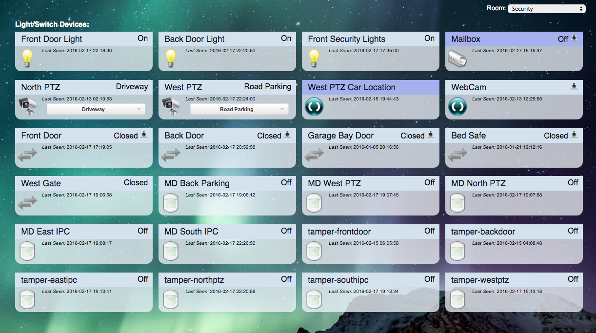

# IP Camera Controller for Home Automation
[]()
[]()
[]()

This is a NodeJS service interfaces with IP Cameras, MQTT and Domoticz, right now it only supports only Dahua cameras.

Goal: Turn your Security Cameras into Home Automation Motion Detectors, also expose any of the Cam's local Alarm IO to your Home Automation System.

It connects with Domoticz via the MQTT JSON API, and your Dahua IPC via HTTP API Alarm Stream.. It also publishes raw states via MQTT for integration with other automation software.

### Features:
* Instant binary input from:
 * Video Motion Detector
 * Alarm Inputs (Dry Contacts)
 * Video Blank / Video Loss
* Domoticz: Selector Switches for PTZ Presets
* Switch between Day/Night Mode
* Switch External Output
* Publishes Domoticz JSON via MQTT
* Publishes Raw Values via MQTT @ ipcc/CameraName

### Software:
* IPC Controller - ME!
* Domoticz - http://www.domoticz.com
* Debian Jessie w/NodeJS from NodeSource repository
* Mosquitto MQTT Broker

### Domoticz Setup:
> presumes debian based linux and working domoticz, git, nodejs and npm.

1. Install MQTT Broker (apt-get install mosquitto)
2. Configure MQTT Hardware in Domoticz (Setup -> Hardware -> Type: MQTT Client Gateway)
3. Create Dummy Hardware in Domoticz called "IPCC"
4. Add Dummy Switches for each Camera's Video Motion Detection, set as: Motion Sensors.
5. Add Dummy Switches for each Camera's Tamper Features, set as: Motion Sensors.
6. Add Dummy Switches for each Camera's Alarm Inputs, set as: Motion Sensors/Contact Switches.
7. Get Switch IDX from Domoticz for IPCC Configuration (Setup -> Devices -> Search)
8. Install IPCC

### Install:
```bash
git clone https://github.com/nayrnet/domoticz-ipcc.git ipcc
cd ipcc
npm install
cp config.example config.js
nano config.js
# Edit aproprately, save.
./daemon.js start
```
> See the ipcc/etc folder for system init scripts and optional syslogd support.

###  IPCC MQTT Publishes
Raw values are published to the following locations:
* ipcc/connected
 * true/false - IPCC Presence
* ipcc/CameraName/VideoMotion 		
 * true/false - Video motion Detection
* ipcc/CameraName/AlarmLocal/id
 * true/false - Local Alarm IO, id is usually 1 or 2
* ipcc/CameraName/VideoLoss
 * true/false - Video Errors
* ipcc/CameraName/VideoBlind
 * true/false - Blank Screen

###  IPCC MQTT Subscriptions
IPCC is subscribed to the following locations, incoming data will be sent to you camera.
* ipcc/CameraName/NightProfile
 * send true to enable night profile
* ipcc/CameraName/DayProfile
 * send true to enable day profile
* ipcc/CameraName/AlarmOutput
 * true/false - Local Alarm IO, id is usually 1 or 2
* ipcc/CameraName/GoToPreset
 * interger - PTZ Command go to Preset


### Domoticz Screenshot:
Domoticz Devices:


### TO DO
* PTZ Selector Switch
* External Output
* Day/Night Switch
* Input data via MQTT

#### Support:
> No support provided or warranty impied, this project is avilable for educational use and my own personal tracking.
